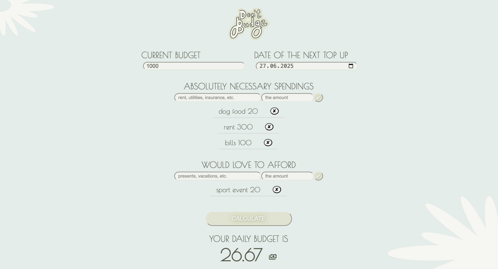

# Don’t Budge

A simple, day-to-day budget calculator tailored to how I personally track expenses.

## Table of Contents

- [Overview](#overview)
  - [Screenshot](#screenshot)
  - [Links](#links)
- [My Process](#my-process)
  - [Built With](#built-with)
  - [What I Learned](#what-i-learned)
- [Author](#author)

## Overview

I found myself regularly calculating my budget in a specific way using a basic calculator. So I thought - why not create a tool that mirrors exactly how I think about my expenses?

**Don’t Budge** is a lightweight budget calculator designed with that idea in mind. Everything from the logo to the floral patterns was custom-made. The project is fully responsive, working smoothly across desktops and mobile devices, and was built using vanilla HTML, CSS, and JavaScript.

### Screenshot

### Links

- GitHub Repository: [Don’t Budge on GitHub](https://github.com/aqpil/Don-t-Budge)
- Live Site: [aqpil.github.io/Don-t-Budge](https://aqpil.github.io/Don-t-Budge/)

## My Process

### Built With

- HTML
- CSS
- JavaScript

### What I Learned

This project was a full start-to-finish experience — from naming the app and choosing fonts, to building a responsive layout and writing custom logic for budget calculations.

The highlight for me was developing a custom input flow and ensuring that user-entered values were handled intuitively and accurately within the interface.

## Author

Created by [@aqpil](https://github.com/aqpil) ✨
